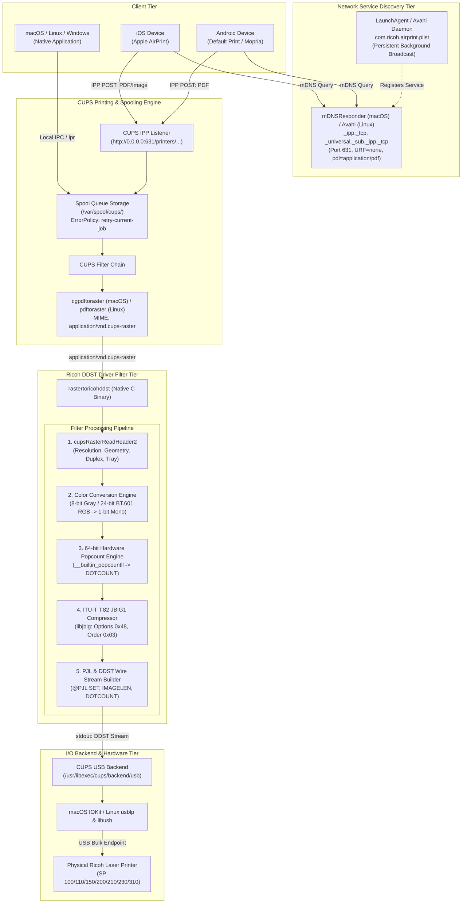
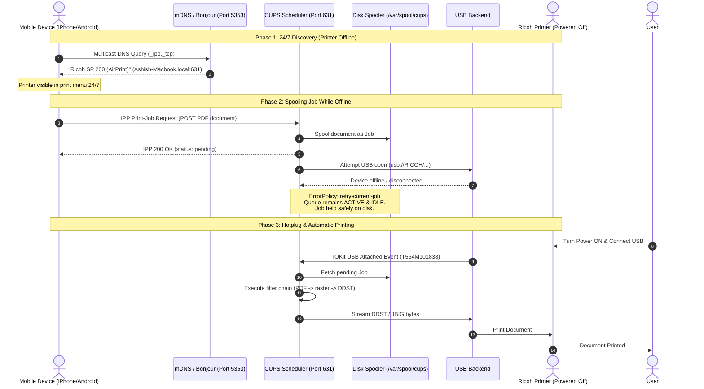

# Ricoh Universal DDST/GDI Driver Suite — System Design & Technical Architecture

## 1. Executive Summary & Purpose

The **Ricoh Universal DDST/GDI CUPS Driver Suite** is a native, high-performance raster filter, network print server, and Adobe-compliant PostScript Printer Description (PPD) driver system. It supports Ricoh DDST (Device Driver String Translation) and GDI monochrome laser and multifunction printers on **macOS** (Apple Silicon M1/M2/M3/M4 & Intel x86_64) and **Linux** (Debian, Ubuntu, Fedora, Arch, Raspberry Pi OS).

DDST printers are host-based ("GDI") laser printers that lack on-board PostScript (PS) or PCL interpreters. Instead of rendering page description languages in hardware, they require the host operating system to rasterize documents into 1-bit monochrome bitmaps, compress the pixels using ITU-T T.82 JBIG1 bi-level encoding, and encapsulate the payload within Hewlett-Packard Printer Job Language (HP-PJL) and Ricoh DDST framing sequences before transmission over USB or network sockets.

This document details the complete end-to-end architecture, protocol reverse-engineering findings, hardware model extrapolation, network/mobile printing subsystem (AirPrint & IPP), spool queue state machines, sandboxing models, and validation strategies.

---

## 2. High-Level System Architecture

The following diagram illustrates the complete data flow from application clients (desktop, mobile, cloud) down to the physical laser diode and print drum:



---

## 3. Print Subsystem & Filter Pipeline

CUPS processes all documents via a pipelined filter architecture coordinated by MIME typing and PPD declarations.

### 3.1 PPD & Filter Binding
Each supported printer model is assigned a PostScript Printer Description file (in `ppd/*.ppd`). The PPD defines:
```postscript
*cupsVersion: 2.0
*cupsFilter: "application/vnd.cups-raster 0 rastertoricohddst"
```
On macOS, due to sandbox restrictions, this path is rewritten during installation to an absolute path:
```postscript
*cupsFilter: "application/vnd.cups-raster 0 /Library/Printers/Ricoh/Filter/rastertoricohddst"
```

### 3.2 Inbound Stream Parsing (`cupsRasterReadHeader2`)
The filter opens the raster stream via file descriptor 0 (`stdin`) or argument 6:
```c
cups_raster_t* ras = cupsRasterOpen(fd, CUPS_RASTER_READ);
cups_page_header2_t hdr;
while (cupsRasterReadHeader2(ras, &hdr)) { ... }
```
Extracted metadata includes:
- **Geometry**: `cupsWidth`, `cupsHeight`, `cupsBytesPerLine`.
- **Resolution**: `HWResolution[0]` (e.g., 600 DPI, 1200 DPI).
- **Color Depth**: `cupsBitsPerPixel` (1, 8, 24, or 32 bpp).
- **Color Space**: `cupsColorSpace` (CUPS_CSPACE_K, CUPS_CSPACE_W, CUPS_CSPACE_RGB).
- **Media Specs**: `PageSize` (A4, Letter, Legal), `MediaPosition` (Tray 1 vs Manual Feed).
- **Duplex & Tumble**: `Duplex` (boolean), `Tumble` (short vs long edge binding).

### 3.3 Color & Luminance Conversion Engine
While CUPS rasterizes monochrome jobs to 1-bit natively, mobile devices and certain PDF rasterizers deliver 8-bit Grayscale or 24-bit sRGB streams. `rastertoricohddst` implements an optimized in-memory thresholding and dithering conversion engine:

1. **8-bit Grayscale Thresholding**:
   $$\text{Pixel}_{\text{mono}} = \begin{cases} 1 (\text{Black}), & \text{if } P_{8} < 128 \\ 0 (\text{White}), & \text{if } P_{8} \ge 128 \end{cases}$$
   *(Inverted if `cupsColorSpace == CUPS_CSPACE_K`)*.

2. **24-bit sRGB to Monochrome Luminance**:
   Applies integer ITU-R BT.601 perceptual luminance weights:
   $$Y = \frac{77 \cdot R + 150 \cdot G + 29 \cdot B}{256}$$
   $$\text{Pixel}_{\text{mono}} = \begin{cases} 1 (\text{Black}), & \text{if } Y < 128 \\ 0 (\text{White}), & \text{if } Y \ge 128 \end{cases}$$

Bits are packed MSB-first into a byte-aligned stride:
```c
acc = (unsigned char)((acc << 1) | (black ? 1 : 0));
```

### 3.4 High-Speed 64-Bit Hardware Popcount Engine (`count_dots`)
The Ricoh hardware engine requires an accurate count of all printed dots per page passed via `@PJL SET DOTCOUNT=...`. The engine uses this value to measure toner consumption, maintain electrostatic charge balance, and manage the waste toner counter.

To avoid performance degradation on large rasters (e.g., 1200x600 DPI Legal size containing > 67 million pixels), `rastertoricohddst` employs hardware 64-bit popcount intrinsics:
```c
STATIC unsigned long count_dots(const unsigned char* bmp, unsigned w, unsigned h)
{
    unsigned stride = (w + 7) / 8;
    size_t total_bytes = (size_t)stride * h;
    size_t u64_count = total_bytes / sizeof(uint64_t);
    const uint64_t* p64 = (const uint64_t*)(const void*)bmp;
    unsigned long n = 0;

    for (size_t i = 0; i < u64_count; i++) {
        n += (unsigned long)__builtin_popcountll(p64[i]);
    }

    const unsigned char* p8 = bmp + u64_count * sizeof(uint64_t);
    for (size_t i = 0; i < total_bytes % sizeof(uint64_t); i++) {
        n += (unsigned long)__builtin_popcount(p8[i]);
    }
    return n;
}
```
This processes 64 pixels per CPU cycle on modern ARM64 and x86_64 architectures.

---

## 4. Reverse-Engineered Wire Protocol & PJL Framing

The wire stream sent to the Ricoh USB endpoint is an encapsulated hybrid stream combining HP-PJL and JBIG1 Bi-level Image Entity (BIE) data.

### 4.1 Job Preamble
```text
\x1b%-12345X@PJL\r\n
@PJL SET TIMESTAMP=YYYY/MM/DD HH:MM:SS\r\n
@PJL SET FILENAME=printjob\r\n
@PJL SET COMPRESS=JBIG\r\n
@PJL SET USERNAME=lp\r\n
@PJL SET COVER=OFF\r\n
@PJL SET HOLD=OFF\r\n
@PJL SET PAGESTATUS=START\r\n
@PJL SET COPIES=1\r\n
@PJL SET MEDIASOURCE=TRAY1\r\n
@PJL SET MEDIATYPE=PLAINRECYCLE\r\n
@PJL SET DUPLEX=OFF\r\n
```

### 4.2 Page Header
Each page begins with its geometry parameters:
```text
@PJL SET PAPER=A4\r\n
@PJL SET PAPERWIDTH=4760\r\n
@PJL SET PAPERLENGTH=6736\r\n
@PJL SET RESOLUTION=600\r\n
@PJL SET IMAGELEN=<LengthOfCompressedBIEInBytes>\r\n
```

### 4.3 JBIG1 Compression (ITU-T T.82)
The compressed binary BIE payload follows immediately after `@PJL SET IMAGELEN=...`.
- Encoded using `libjbig` (`jbg_enc_init` and `jbg_enc_options`).
- **Options**: `0x48` (`JBG_HITOLO | JBG_VLENGTH`).
- **Order**: `0x03` (`JBG_ILEAVE | JBG_SMID`).
- **Lines Per Stripe (LDP)**: `128`.

### 4.4 Page Trailer & Paper Eject
Immediately following the raw BIE byte sequence:
```text
@PJL SET DOTCOUNT=<PopcountBlackPixels>\r\n
@PJL SET PAGESTATUS=END\r\n
```
The printer firmware requires both `@PJL SET DOTCOUNT` and `@PJL SET PAGESTATUS=END` to actuate the paper feed mechanism and eject the sheet.

### 4.5 Job Epilogue
```text
@PJL EOJ\r\n
\x1b%-12345X\r\n
```
The Universal Exit Language sequence (`\x1b%-12345X`) resets the printer's command parser back to idle standby.

---

## 5. Mobile & Network Printing Subsystem (AirPrint & IPP)

### 5.1 The Mobile Printing Challenge
Standard consumer and office laser printers attached via USB cannot be discovered by smartphones because mobile operating systems (iOS and Android) only discover print devices over Wi-Fi via Multicast DNS (Bonjour / mDNS). Furthermore:
1. **iOS AirPrint Requirements**: Apple devices require specific mDNS TXT keys (`URF`, `pdl`, `rp`) and DNS-SD service subtypes (`_universal._sub._ipp._tcp`). If these are missing, the printer will not appear in the iOS print sheet.
2. **Offline Vulnerability**: Standard CUPS queues pause (`printer-state=stopped`) when a print job fails due to an offline or disconnected USB printer. If a user prints from their phone while the printer is off, standard queues stop accepting further jobs and require manual administrator intervention to resume.

### 5.2 System Design of the Mobile Printing Engine



### 5.3 Persistent mDNS Discovery Daemon
The script [enable_network_printing.sh](file:///Users/ashish/git/Ricoh-SP200-Linux/enable_network_printing.sh) registers a persistent background daemon:
- **macOS LaunchAgent**: Installed to `~/Library/LaunchAgents/com.ricoh.airprint.plist`. Runs `/usr/bin/dns-sd` continuously, surviving reboots and terminal exits.
- **Linux Avahi Service**: Installed to `/etc/avahi/services/ricoh-airprint.service`.

**TXT Record Specifications**:
```text
Service Name:  <Printer Model> (AirPrint)
Service Type:  _ipp._tcp, _universal
Port:          631
TXT Records:
  txtvers=1
  qtotal=1
  rp=printers/<QueueName>
  ty=<ModelName>
  adminurl=http://<HostName>.local:631/printers/<QueueName>
  pdl=application/pdf,image/jpeg
  URF=none
  air=none
```

### 5.4 Offline Spooling & Error Recovery Policy
To guarantee jobs wait on disk when the printer is off or unplugged:
```bash
lpadmin -p <QueueName> -o printer-is-shared=true -o printer-error-policy=retry-current-job
```
- **`retry-current-job`**: Prevents CUPS from stopping or pausing the queue when the USB backend fails to connect. The queue remains `enabled` and `idle/processing`, continuing to accept subsequent jobs from network devices.
- **`printer-is-shared=true`**: Tells the CUPS scheduler to expose the queue over IPP.
- **`cupsctl --share-printers --remote-any`**: Allows incoming TCP connections on port 631 from all IP subnets (2.4GHz Wi-Fi, 5GHz Wi-Fi, Ethernet).

---

## 6. Hardware Model Support & Extrapolation Matrix

| Series | Models | Max Resolution | Duplex | Trays | Supported PPD |
|---|---|---|---|---|---|
| **SP 100** | SP 100, 100e, 100SU, 100SF | 600 DPI | Manual | Tray 1 | `ppd/ricoh-sp100.ppd` |
| **SP 110** | SP 110, 111, 112, SU, SF | 1200x600 DPI | Manual | Tray 1, Manual | `ppd/ricoh-sp111.ppd` |
| **SP 150** | SP 150, 150w, 150SU, 150SUw | 1200x600 DPI | Manual | Tray 1 | `ppd/ricoh-sp150.ppd` |
| **SP 200** | SP 200, 201N/NW, 202, 203, 204 | 1200x600 DPI | Manual | Tray 1, Manual | `ppd/ricoh-sp200.ppd` |
| **SP 210** | SP 210, 211, 212, 213, 220 | 1200x600 DPI | Manual | Tray 1, Manual | `ppd/ricoh-sp210.ppd` |
| **SP 230** | SP 230DNw, 230SFNw | 1200x600 DPI | Auto Duplex | Tray 1, Manual | `ppd/ricoh-sp230.ppd` |
| **SP 310** | SP 310DN, 311DN/SFN, 325, 3710 | 1200x600 DPI | Auto Duplex | Tray 1, Tray 2, Manual | `ppd/ricoh-sp310.ppd` |

---

## 7. Security, Sandboxing & OS Integration

### 7.1 macOS Sandboxing Architecture
macOS executes CUPS filters inside a tightly constrained sandbox environment (`sandbox-exec` / `seatbelt`).
1. **Directory Restrictions**: Custom filters located in `/usr/local/bin` or user home folders fail to execute due to sandbox denial. All binaries must reside in:
   `/Library/Printers/Ricoh/Filter/rastertoricohddst`
2. **File Ownership**: Binaries must be owned by `root:wheel` with permissions `0755`.
3. **Quarantine Bit**: Downloaded or compiled binaries must have the macOS quarantine extended attribute cleared:
   ```bash
   xattr -d com.apple.quarantine /Library/Printers/Ricoh/Filter/rastertoricohddst
   ```

### 7.2 Linux Standard Layout
On Linux, filters and PPDs adhere to the Filesystem Hierarchy Standard (FHS):
- Filter Directory: `/usr/lib/cups/filter/`
- PPD Directory: `/usr/share/ppd/cupsfilters/`

---

## 8. Quality Assurance, Test Suite & CI/CD

### 8.1 Testing Architecture
The codebase includes an automated test framework:

```
tests/
├── generate_test_raster.c   # Synthetic CUPS raster stream generator (10 scenarios)
├── test_mocks.c             # Mock allocator & system time override
├── test_unit_ddst.c         # Unit tests for rastertoricohddst (error injection & logic)
├── test_unit_jbig.c         # Unit tests for rastertoricohjbig
├── test_network_printing.sh # End-to-end IPP, AirPrint, and queue policy tests
└── run_coverage.sh          # gcov line coverage harness (enforces >= 95%)
```

### 8.2 Test Execution Commands
- **Unit & Coverage Suite**:
  ```bash
  make test-coverage
  ```
  Enforces a strict ≥ 95.0% line coverage assertion across both driver filters.
- **Network & Mobile Printing Integration Suite**:
  ```bash
  make test-network
  ```
  Validates live CUPS socket binding, queue retention, and IPP document submission.

### 8.3 Continuous Integration (GitHub Actions)
Every commit and pull request triggers `.github/workflows/ci.yml` across:
- `ubuntu-latest`
- `macos-latest`

Steps executed in CI:
1. PPD validation via `cupstestppd -W filters`.
2. Shell syntax verification via `bash -n`.
3. Test suite execution with `gcov` line coverage assertion (≥ 95%).
4. Strict compilation check (`CFLAGS="-O2 -Wall -Wextra -Werror"`).
5. Native installer package generation (`.pkg` on macOS, `.deb` on Linux).
